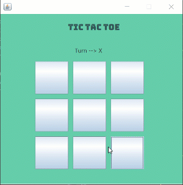

# TicTacToe

I created simple TicTacToe game with Java-Swing.

Gif :arrow_heading_down:

----

Why I used Swing instead of JavaFX ?
------------------------------------

Because I don't now JavaFX at this time. Actually I want to learn JavaFX but there is no time because I have to study to my exams. :worried: But I hope I will learn JavaFX someday :blush:
